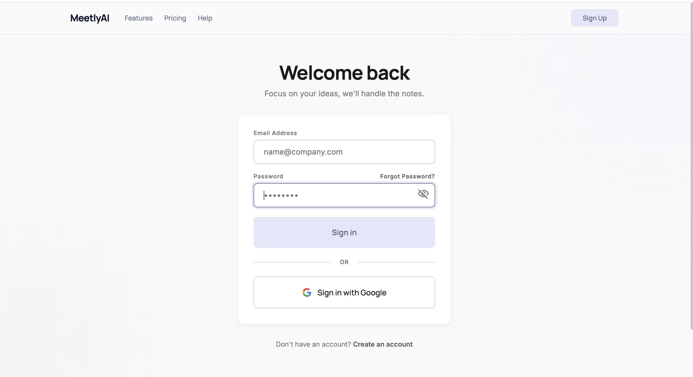
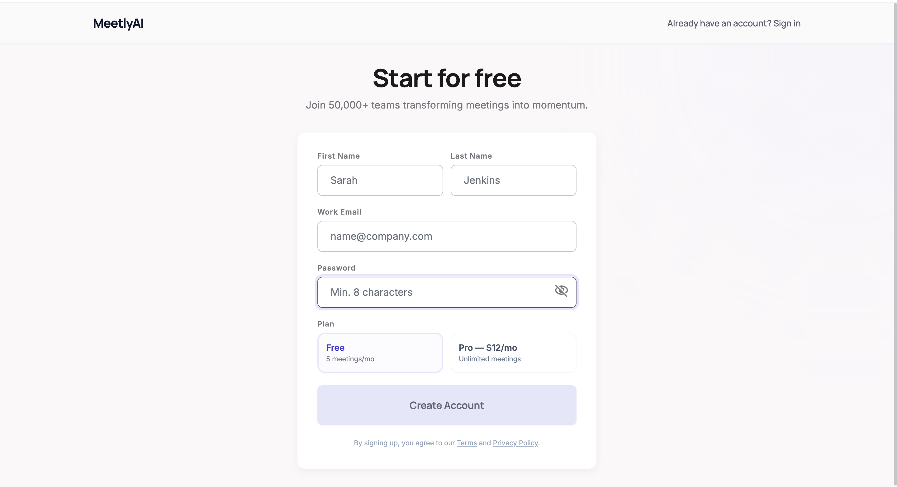
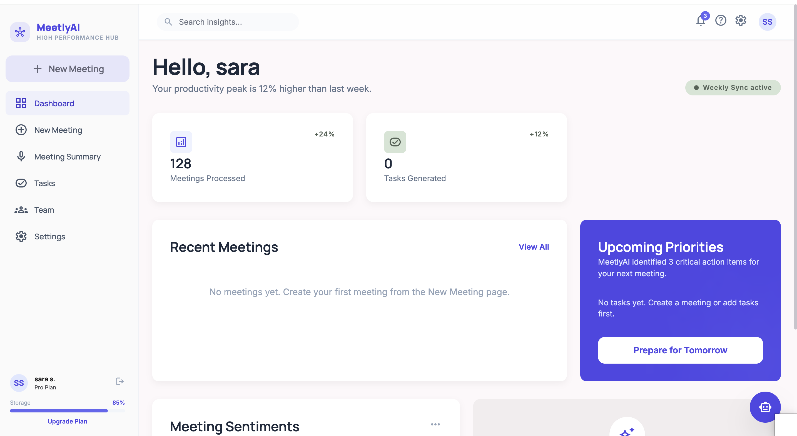
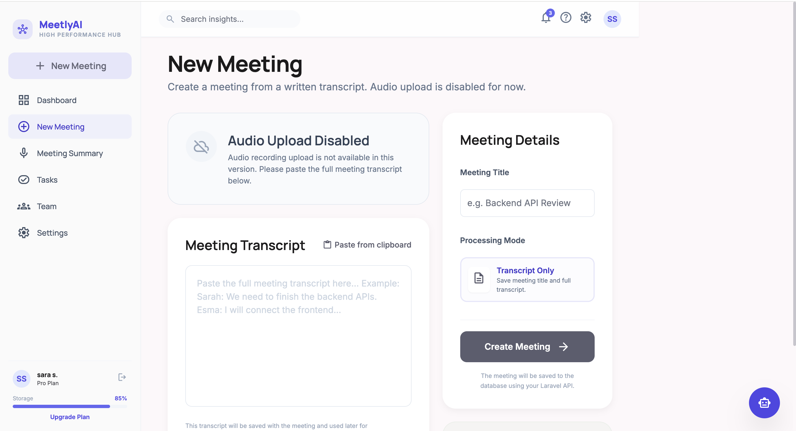
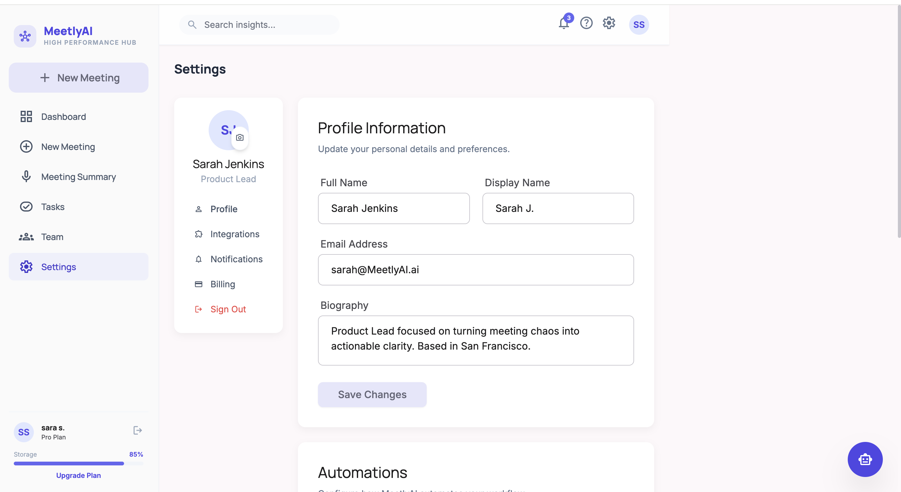
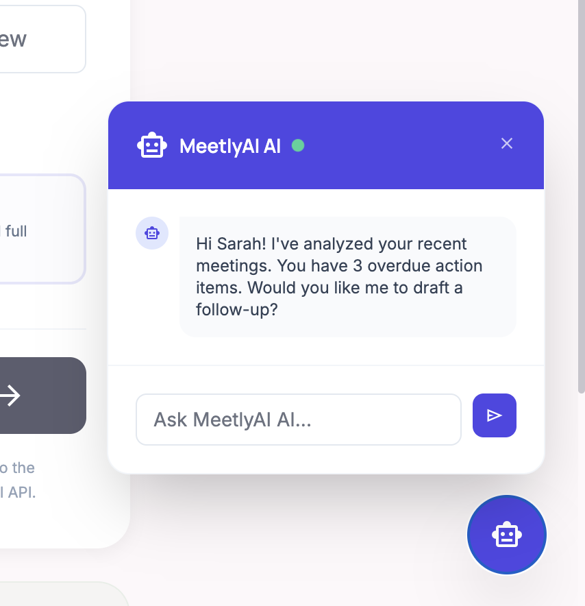

# MeetlyAI

MeetlyAI is an AI-powered meeting productivity platform that helps teams transform meeting transcripts into actionable insights.

The platform enables users to create meetings, process transcripts, generate summaries, extract action items, manage tasks, collaborate with teams, and interact with an AI assistant.

---

## Key Features

### Authentication
- User Registration
- User Login
- Secure Authentication
- Password Recovery
- Google Sign-In Support

### Meeting Management
- Create Meetings
- Store Meeting Transcripts
- Manage Meeting Records
- Meeting Dashboard

### AI Features
- AI Meeting Summaries
- Action Item Extraction
- Follow-Up Suggestions
- AI Productivity Assistant

### Team Collaboration
- Team Management
- Team Invitations
- Shared Meeting Insights

### User Management
- Profile Settings
- Display Name Management
- Notifications
- Integrations
- Subscription Plans

---

## Tech Stack

### Frontend
- Angular
- TypeScript
- HTML
- CSS

### Backend
- Laravel
- PHP
- Sanctum Authentication
- REST APIs

### Database
- MySQL
- SQLite (Development)

---

## Project Structure

frontend/
backend/

---

## Screenshots

### Login

### Register

### Dashboard

### Create Meeting

### Settings

### AI Assistant

---

## Author

Esma Yılmaz
